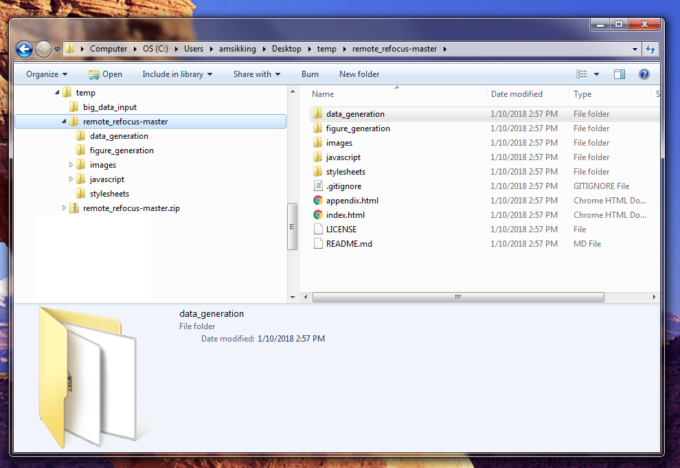

# remote_refocus
Scripts used to generate the figures in the remote refocus manuscript. One script for each logical portion of an interactive figure, e.g.: `figure_1_worm_DIC.py`, `figure_1_worm_TL_FL.py`, `figure_2_yeast_cyto_FL.py`, `figure_3_RR_animation.py`, etc; run these scripts to generate the corresponding figures in the main text. Note there is no script for figure 4 of the main text or the figures in the appendix
as they were not generated programatically.

If you want to run the code you'll need to excecute the following:
1) Download the [remote_refocus repository](https://github.com/AMSikking/remote_refocus/zipball/master), unzip and place into a new folder e.g. `temp`
2) Download the original `big_data_input` folder from Zenodo (17.5GB) [DOI:10.5281/zenodo.1145453](https://doi.org/10.5281/zenodo.1145453) , unzip (27.3GB) and add to the `temp` directory (see screen shot below).

4) Create a Python 3 environment with the associated subpackages [Numpy](http://www.numpy.org/) and [Matplotlib](http://matplotlib.org/).
[Anaconda](https://www.continuum.io/downloads) satisfies these requirements with a single
installation.
5) Install [ImageMagick](https://www.imagemagick.org/script/index.php) and [ffmpeg](https://ffmpeg.org/) or equivalent software to make
the '.gif' or '.mp4' animations. Note: the commands for these package (which are called from the scripts) are platform dependent and will
change depending on the OS. Please refer to the docs for ImageMagick or ffmpeg if you're trying to debug this problem and then edit the
scripts accordingly.
6) Now run the scripts from the `figure_generation` folder to generate the desired figure. The scripts will generate temporary data in the
`temp` folder (which can be deleted afterwards) and the figures from the manuscript in the `big_data_output` folder.

Note that `np_tif.py` and `stack_registration.py` are utility scripts that the other scripts depend on; do not run these scripts
individually.
